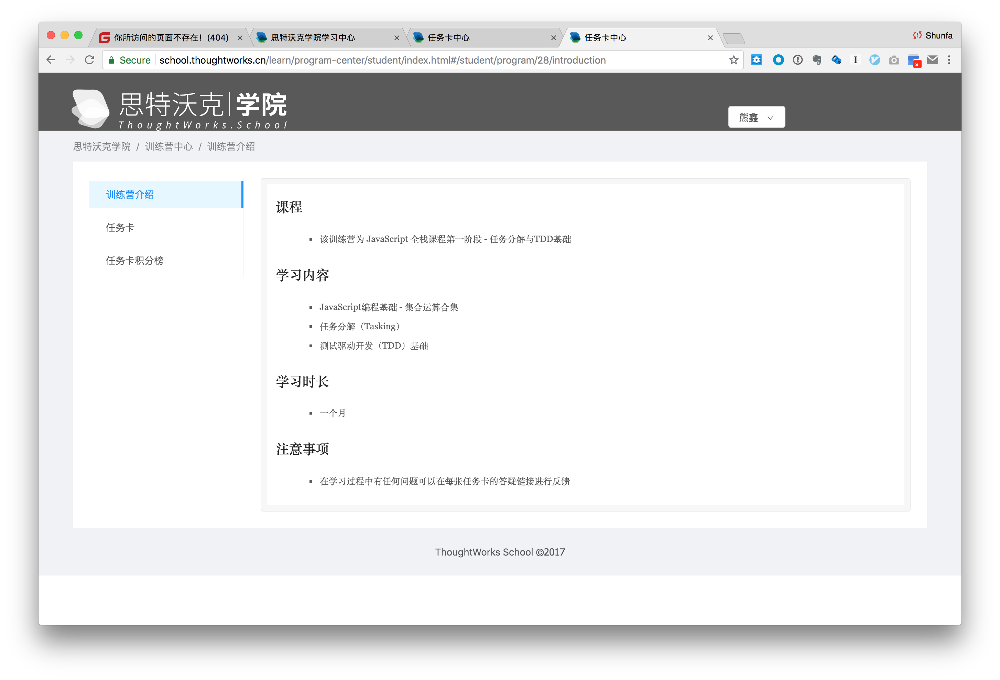
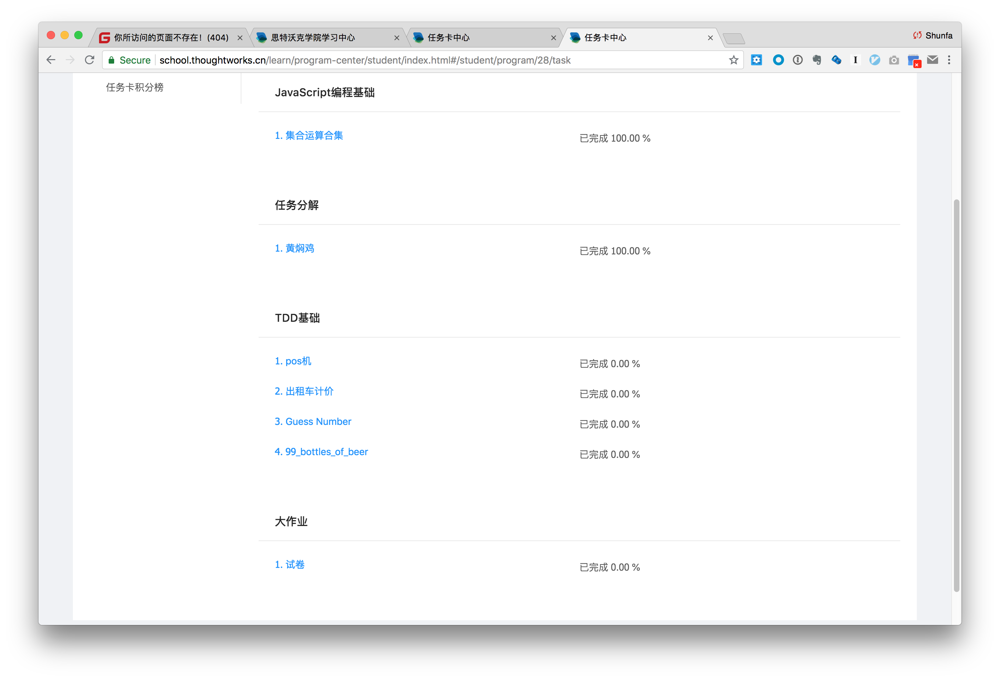
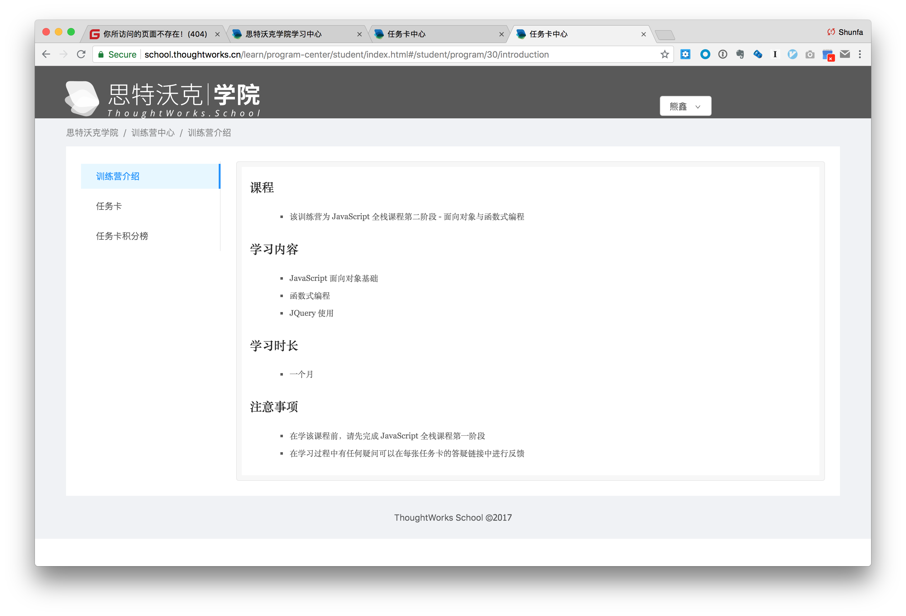
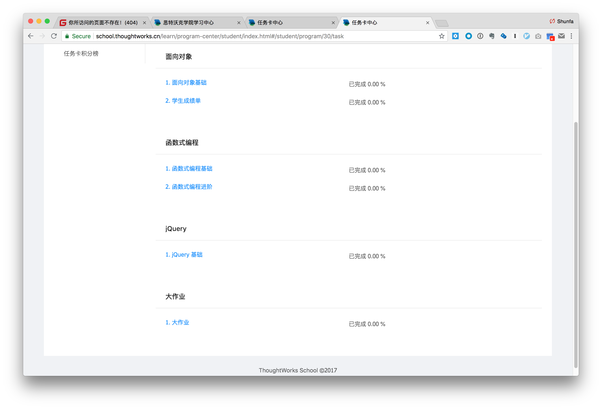
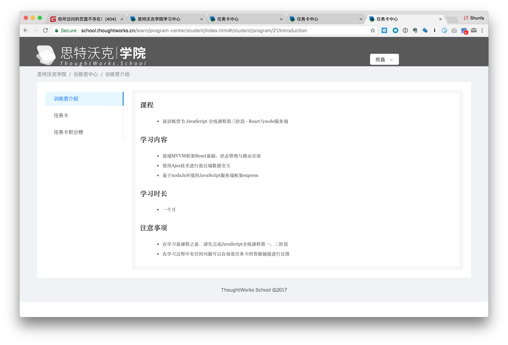
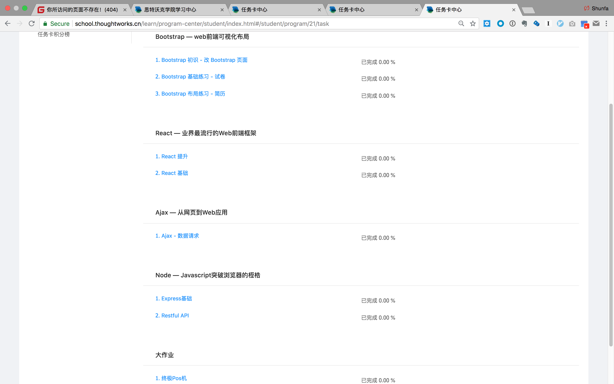

| 编程任务卡列表                                               |
| ------------------------------------------------------------ |
| 任务卡：《[打造程序员的专业工作环境](task101.md)》           |
| 任务卡：《[语义化 HTML 基础 - 试卷](task102.md)》            |
| 任务卡：《[Bootstrap 提高练习 - 改 Bootstrap 页面](task103.md)》 |
| 任务卡：《[Bootstrap 基础练习 - 试卷](task104.md)》          |
| 任务卡：《[Bootstrap 布局练习 - 简历](task105.md)》          |
| 任务卡：《[JavaScript 编程基础 - Pre-Pos（集合运算）](task106.md)》 |
| 任务卡：《[JavaScript 编程基础 - 可选 - 集合运算全集](task107.md)》 |
| 任务卡：《[任务分解 - 试卷](task108.md)》                    |
| 任务卡：《[任务分解 - Pos 机](task109.md)》                  |
| 任务卡：《[任务分解 - 黄焖鸡](task110.md)》                  |
| 任务卡：《[TDD 基础 - FizzBuzz](task111.md)》                |
| 任务卡：《[TDD 基础 - Pos 机](task112.md)》                  |
| 任务卡：《[TDD 练习 - 出租车计价](task113.md)》              |
| 任务卡：《[单元测试技术 - Guess Number](task114.md)》        |
| 任务卡：《[面向对象基础 - OO step by step](task115.md)》     |
| 任务卡：《[练习 - 学生成绩单 命令行版](task117.md)》         |
| 任务卡：《[函数式编程进阶](task120.md)》                     |
| 任务卡：《[jQuery 基础 - 表单定义器](task121.md)》           |
| 任务卡：《[用 jQuery 实现 Pos 机](task122.md)》              |
| 任务卡《[React 基础 - 表单定义器](task123.md)》              |
| 任务卡《[React Redux Router - 表单定义器](task124.md)》      |
| 任务卡：《[用 React 实现 Pos 机](task125.md)》               |
| 任务卡：《[Express 基础 - 表单定义器](task126.md)》          |
| 任务卡：《[Ajax - 数据请求](task127.md)》                    |
| 任务卡：《[Express 基础 - 构建restful风格的服务API](task128.md)》 |
| 任务卡：《[练习 - 学生成绩单 Web版](https://github.com/tws-practice/student-score-sheet-web-version)》              |
| 任务卡：《[练习 - 学生成绩单 API版](https://github.com/tws-practice/student-score-sheet-api-version)》              |

#### Phase-1-intro

#### Phase-1-tasks

#### Phase-2-intro

#### Phase-2-tasks

#### Phase-3-intro

#### Phase-3-tasks

